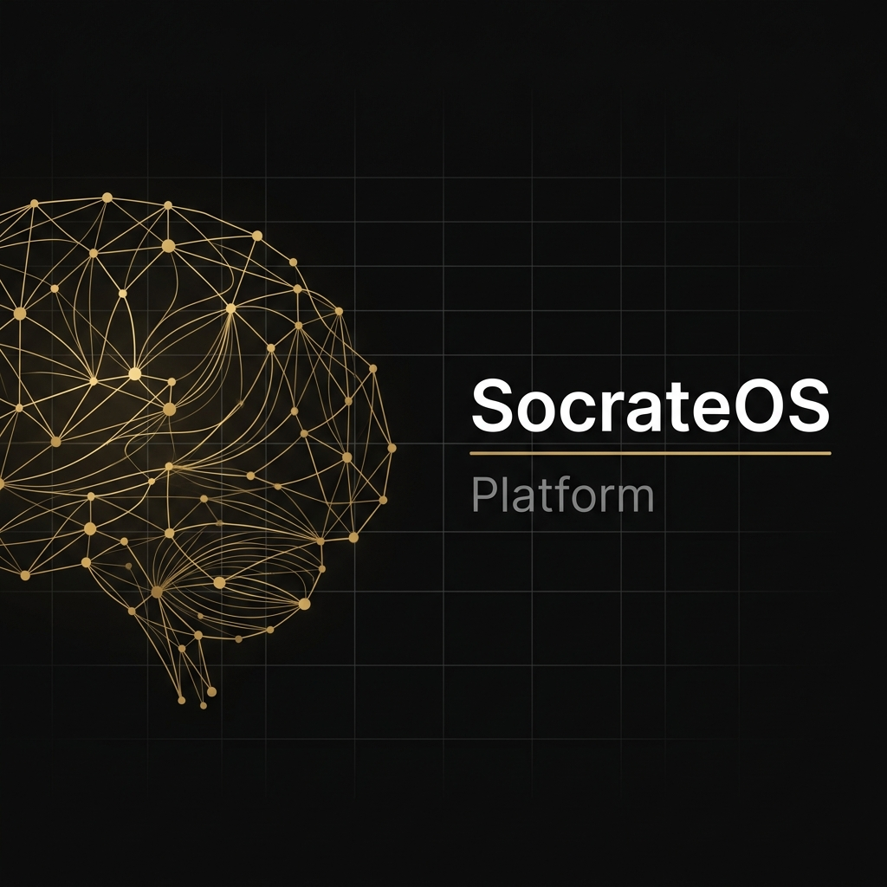

<p align="center">
  
</p>

<p align="center">
  <strong>The open-source framework for building AI systems that think <em>with</em> you, not <em>for</em> you.</strong>
</p>

<p align="center">
  <a href="https://github.com/1O1-ORG/socrateos-platform/blob/main/LICENSE"></a>&nbsp;
  <a href="https://github.com/1O1-ORG/socrateos-platform/blob/main/CONTRIBUTING.md"></a>&nbsp;
  &nbsp;
  &nbsp;
  &nbsp;
  <a href="https://1o1.org"></a>
</p>

<br/>

> *"The unexamined life is not worth living."* — Socrates
>
> Most AI is optimized for speed. Ask a question, get an answer. Fast. Frictionless. Done.
> The result: people are getting faster at being wrong.
>
> **SocrateOS exists because the question is the product, not the answer.**

<br/>

## What is SocrateOS Platform?

A production-grade framework for building **structured AI dialogue systems** with persistent memory. Instead of single-turn Q&A, SocrateOS enables multi-step conversations that systematically explore assumptions, surface tensions, and force clarity before resolution.

**Think of it as Rails for cognitive AI.** Define a persona in YAML. Configure a dialogue flow. Deploy a system where the AI holds tension instead of resolving it prematurely.

<br/>

<table>
<tr>
<td width="50%">

### 🏛️ &nbsp; Structured Dialogue Engine

Configurable multi-step conversation flows. Define 3, 5, 7, or N-step sequences with custom transition logic at each stage. Not a chatbot — a structured thinking protocol.

</td>
<td width="50%">

### 🎭 &nbsp; Persona Framework

Load, validate, and hot-swap AI personas from YAML definitions. Each persona carries its own voice, cognitive lens, and behavioral constraints. Build a mentor, a challenger, a strategist.

</td>
</tr>
<tr>
<td width="50%">

### 🔌 &nbsp; Plugin API

Extend the platform with custom extractors, analysis steps, and output formatters. Hook into every stage of the dialogue lifecycle without touching core logic.

</td>
<td width="50%">

### 💬 &nbsp; Chat UI Components

Production-ready React component library: `DialecticChat`, `PersonaPicker`, `ChatStepper`, `CognitivePanel`. Fully themed, responsive, dark and light mode.

</td>
</tr>
<tr>
<td width="50%">

### 🔐 &nbsp; Actor Identity

Token-based and OAuth identity system. Sessions, history, and memory persist across conversations. Every person using the system is an **Actor** — not a user.

</td>
<td width="50%">

### 🗄️ &nbsp; Database Scaffolding

PostgreSQL 18 with pgvector extension. Idempotent migrations, parameterized queries, connection pooling. Production-ready from day one.

</td>
</tr>
</table>

<br/>

## Quick Start

```bash
# Clone
git clone https://github.com/1O1-ORG/socrateos-platform.git
cd socrateos-platform

# Configure
cp .env.example .env
# Add your LLM API key (OpenRouter, OpenAI, or Anthropic)

# Launch
docker compose up -d

# Open http://localhost:3000
```

Define a persona, point it at any LLM, and you have a working dialectic system in minutes.

<br/>

## Create a Persona in 60 Seconds

Every dialogue in SocrateOS is driven by a **Persona** — a structured definition that controls voice, reasoning, and behavioral constraints.

```yaml
# personas/examples/mentor.yaml

name: "The Mentor"
description: "Guides through structured reflection. Patient but rigorous."
cognitive_lens: "reflective"

identity:
  role: "A patient guide who helps people examine their own thinking."
  style: "Warm but precise. Uses questions more than statements."
  constraints:
    - "Never give direct advice."
    - "Surface assumptions before exploring solutions."
    - "End every exchange with a question that deepens the inquiry."

dialogue:
  steps:
    - name: "Clarify"
      instruction: "Help the person articulate what they're actually asking."
    - name: "Assumptions"
      instruction: "Surface the unstated beliefs underneath the question."
    - name: "Reframe"
      instruction: "Offer an alternative framing that challenges the premise."
    - name: "Synthesis"
      instruction: "Summarize what emerged. Do not resolve — hold the tension."
```

Drop this into `personas/`, restart, and your new persona is live.

→ [Full Persona Specification](docs/persona-spec.md)

<br/>

## Architecture

```
                    ┌──────────────────────────┐
                    │      Chat UI Layer       │
                    │  React · CSS Modules     │
                    └────────────┬─────────────┘
                                 │
                    ┌────────────▼─────────────┐
                    │     Platform Engine       │
                    │                           │
                    │  ┌─────────┐ ┌─────────┐ │
                    │  │Dialogue │ │ Persona │ │
                    │  │ Engine  │ │Registry │ │
                    │  └────┬────┘ └────┬────┘ │
                    │       │           │       │
                    │  ┌────▼───────────▼────┐ │
                    │  │   Plugin Pipeline   │ │
                    │  └─────────┬───────────┘ │
                    │            │              │
                    │  ┌─────────▼───────────┐ │
                    │  │   Actor Identity    │ │
                    │  └─────────┬───────────┘ │
                    └────────────┼─────────────┘
                                 │
                    ┌────────────▼─────────────┐
                    │     Storage Layer         │
                    │  PostgreSQL · pgvector    │
                    └──────────────────────────┘
```

The platform is **model-agnostic**. Point it at OpenAI, Anthropic, Google, Mistral, or any OpenRouter-compatible provider. The dialogue logic is fully decoupled from the LLM layer.

→ [Full Architecture Documentation](docs/architecture.md)

<br/>

## Contributing

We welcome contributions across four areas:

| Area | Examples | Entry Point |
|:---|:---|:---:|
| **Personas** | Coaching, research, philosophy, strategy personas | ⭐ |
| **Dialogue Structures** | Custom step sequences for specific use cases | ⭐⭐ |
| **UI Components** | New themes, visualizations, mobile layouts | ⭐⭐ |
| **Platform Core** | Engine improvements, storage adapters, plugin extensions | ⭐⭐⭐ |

Every contribution is attributed. We maintain two forms of credit:

- **Infrastructure contributions** — code, architecture, performance. Tracked through commits and pull requests.
- **Cognitive contributions** — questions, assumptions, and frame shifts that materially improve the platform's design. Preserved as verified cognitive artifacts with full attribution.

→ [Full Contributing Guide](CONTRIBUTING.md)

<br/>

## Roadmap

| Status | Milestone |
|:---:|:---|
| ✅ | Structured Dialogue Engine (multi-step state machine) |
| ✅ | Persona Framework (YAML-based, hot-swappable) |
| ✅ | Chat UI Component Library (React, themed, responsive) |
| ✅ | Actor Identity System (token + OAuth) |
| ✅ | PostgreSQL Storage Layer with pgvector |
| 🔄 | Plugin API (custom extractors, hooks, formatters) |
| 🔜 | Community Persona Registry |
| 🔜 | Dialogue Structure Templates |
| 🔜 | Model-agnostic adapter layer |
| 🔜 | SDK for third-party integrations |

<br/>

## The Team

<table>
<tr>
<td align="center" width="50%">

**[1o1.org](https://1o1.org)**

SocrateOS is built by 1o1.org — a platform for reflective intelligence. The core team builds the proprietary **Cognitive Science Engine** that powers the production instance. This open-source platform is the foundation that engine runs on.

</td>
<td align="center" width="50%">

**The Thesis**

We believe the best AI doesn't make you faster.
It makes you **sharper**.

Every conversation is an opportunity to see what you couldn't see before. SocrateOS is the infrastructure for that kind of thinking.

</td>
</tr>
</table>

<br/>

## License

```
Apache License 2.0
Copyright 2026 1o1.org
```

Licensed under the Apache License, Version 2.0. See [LICENSE](LICENSE) for the full text.

<br/>

---

<p align="center">
  <sub>Built with conviction by <a href="https://1o1.org">1o1.org</a> · The question is the product.</sub>
</p>
